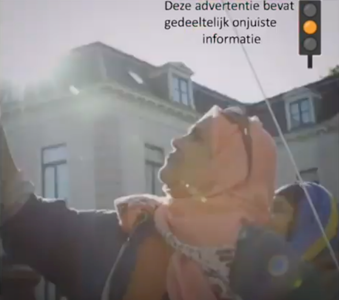

layout: true
    
<div class="logo"></div> 

<style>
.onehundredtwenty {
  font-size: 120%;
   }

<style>
.ninety {
  font-size: 90%;
   }

.eightyfive {
  font-size: 85%;
   }
   
.eighty {
  font-size: 80%;
   }
   
.seventyfive {
  font-size: 75%;
   }
   
.seventy {
  font-size: 70%;
   }
   
.fifty {
  font-size: 50%;
   }
   
.forty {
  font-size: 40%;
   }
</style>


```{r setup, include=FALSE}
# Here you can place global options for the entire document.
# Mostly used for knitr settings, but can also load data etc.
# Whatever happens here will not show in the presentation.
knitr::opts_chunk$set(fig.retina = 3, 
                      warning = FALSE, 
                      message = FALSE,
                      echo = TRUE)

library(tidyverse)

analysis_dat <- readRDS("../data/analysis_dat.rds") %>% 
    drop_na(age, gender, pol_interest) %>% 
    # summarise(age = mean(age))
    mutate(saw_label_or_control = ifelse(saw_label_or_control == "Failed Control?", "Yes", saw_label_or_control)) %>%
    mutate(gender = fct_relevel(gender, c("male", "female")))
```

---

#### Confronting misinformation on social media


+ *"De-biasing"* to help citizens defend against mis- and disinformation (Lewandowsky et al., 2012). 

<br>

+ Regulatory proposals aim to help citizens via labels

<br>

--

+ Code of Practice on Disinfo calls for “facilitating the assessment of content through indicators of the trustworthiness of content sources (…)” (European Commission, 2018; p.8)

<br>


+ The draft regulation on transparency of political advertising explicitly requires the use of labeling techniques (European Commission, 2021). 


<br>


+ ERGA finds labeling approaches preferable to the removal of false content (ERGA, 2021)


---


class: split-four

#### Problem: cacophony of labels


No clear and uniform directions on design, timing, and positioning


.pull-left[

]

.pull-right[


]


---

#### Problems of multitude of labels

+ Not all designs are equally effective (Binford et al., 2021)

<br>


+ Confusing for the user (ERGA, 2021)

<br>

+ Research has shown how design, timing and formulations matter  (e.g., Boerman & Kruikemeier, 2016; Wojdynski & Evans, 2016)

<br>

+ Social platforms take it up themselves to design and test labels (not based on indepedent research)


---

#### Learning from the nutrition label literature


.pull-left[
Nutrition labels have been used for years to communicate nutritional values, and raise awareness of ‘healthiness’

*Traffic light labeling system (TLS)*, recognizable, raised awareness (Freire et al., 2017) and improved behavior (e.g., Thorndike, 2014)


> Key question: To what extent are traffic light veracity labels effective in helping citizens evaluate the credibility of information in a political advertisement? 


]


.pull-right[


]

---

class: middle, center

# Research Design

---


#### Research Design


Experimental design showing a (YouTube) video stimulus

+ Participants saw political advertisement calling for an increase in the minimum wage. 

+ This political issue ad was sponsored by Dutch union FNV, but references to FNV were removed from the video. 

<center>


</center>

---


#### Research Design


Experimental design with 8 conditions

+ Green (1), Red (2), and Orange (3) Traffic Light (*at the start*)

+ Green (4), Red (5), and Orange (6) Traffic Light (*during first 10 seconds*)

+ Not rated yet (7)

+ Control condition with *no label* (8)


.pull-left[

.pull-left[
Traffic light **before** video. 

Translation: “This advertisement contains false information.”
]

.pull-right[]


]

.pull-right[

.pull-left[
Traffic light **concurrent** with video. 

Translation: “This advertisement contains partly false information.”

]

.pull-right[

]


]


---

#### Dependent variables

+ Source credibility

11 items, all on 7-point scales (7 is higher credibility): 

> Based on this video, I think the source of this video is… *trustworthy, experienced, honest, knowledgeable, authentic, sincere, competent, has expertise on the matter, capable, credible, appealing.* 

+ Message credibility

8 items, all on 7 point scales (7 is higher credibility)

> *I can trust that this video **tells the truth**; I think the goal of this video is to **inform the Dutch citizens**; I find the video **informative**; I find the video **sincere**; The video is a **reliable source of information**; The video **reflects the truth** well; I feel like I have been **informed correctly** by the video; In general, the video creates a **reliable picture** of the FNV.*

---

#### Expectations

> Red and orange lights **reduce** source and message credibility

> Not rated yet label **reduces** source and message credibility (but to lesser extent)

> Green light **increases** source and message credibility 

---

#### Mediator


We expect that ‘false information awareness’ mediates the effects of the IV’s on the DV’s.

Measured on a 7-point scale. The variable consisted of the following two items: *the video contained false information*, and *the video is fake*.


---


#### Data

+ Data collection: October 2019 (Kantar Lightspeed - small incentive)

We removed:

1.) speedsters who did not view the stimulus in its entirety (N=454). 

Missing values for our control variables: 

2.) age, gender, and political interest (N=42). 

**Final sample size: 1054 participants**

~120-140 people per condition

Randomization checks: age, gender, political interest &#10003;

.eightyfive[
Mean age in the sample was 44.12 (SD=13.45), and 53.51 percent were female. The mean political interest in the sample was 4.48 (SD=1.48), on a scale from 1 to 7 (7=higher level of political interest).
]


---


class: white

#### How many people noticed labels? (manipulation check)

--

.leftcol60[

```{r, echo=F, eval = F}
analysis_dat  %>% 
    filter(watch_check) %>% 
    # filter(is.na(age) | is.na(gender) | is.na(pol_interest)) %>% 
    drop_na(age, gender, pol_interest) %>% 
    # summarise(age = mean(age))
    # mutate(saw_label_or_control = ifelse(saw_label_or_control == "Failed Control?", "Yes", saw_label_or_control)) %>% 
    count(saw_label_or_control, conditions, label_time, sort = T) %>% 
    group_by(conditions) %>% 
    mutate(total = sum(n)) %>% 
    mutate(perc = round(n/sum(n)*100, 2)) %>% 
  filter(saw_label_or_control == "Yes" | saw_label_or_control == "Failed Control?") %>%
  filter(!(saw_label_or_control == "Yes" & conditions == "control")) %>% 
  mutate(conditions = case_when(
    str_detect(conditions, "green_start") ~   "GREEN [start]",
    str_detect(conditions, "green_during") ~  "GREEN [during]",
    str_detect(conditions, "orange_start") ~  "ORANGE [start]",
    str_detect(conditions, "orange_during") ~ "ORANGE [during]",
    str_detect(conditions, "red_start") ~     "RED [start]",
    str_detect(conditions, "red_during") ~    "RED [during]",
    str_detect(conditions, "rated") ~         "NOT RATED YET",
    str_detect(conditions, "control") ~       "CONTROL"
  )) %>% 
  ungroup() %>% 
  # mutate(conditions = fct_reorder(conditions, perc)) %>% 
  mutate(conditions = fct_relevel(conditions, c("GREEN [start]",
                                                "GREEN [during]",
                                                "ORANGE [start]",
                                                "ORANGE [during]",
                                                "RED [start]",
                                                "RED [during]",
                                                "NOT RATED YET",
                                                "CONTROL"
                                                ) %>% rev)) %>% 
  # filter(conditions != "control") %>% 
  ggplot(aes(conditions, perc)) +
  geom_col(aes(fill = label_time)) +
  coord_flip() +
  geom_label(aes(label= perc)) +
  theme_minimal() +
  theme(legend.position = "none") +
  labs(y = "Percentage of people that reported to see a label", x = "") +
  scale_fill_manual(values = c( "grey", "black"))

ggsave(filename = "img/saw_label.png", width = 7, height = 5)
```


]

.rightcol40[

Notice how the ‘during’ labels are noticed less than the ‘before’ labels.


People who do not remember can still be affected so we kept all participants in our main analyses (but also report analyses without them)

]


---

class: middle, center

# Results

---


class: white

.leftcol65[


*Treatment effect* on everyone (N = 1054)

]


.rightcol35[

<br><br>

Only the Red & Orange light shown *concurrent* significantly affected credibility perceptions

More political interest associated with generally higher credibility perceptions

Women in general held higher credibility perceptions.


]

---


class: white

#### Mediation effects - Full sample (N = 1054)

All proposed mediation effects are not statistically significant except for:

*Orange light during advertisement*

<center>


</center>


---


#### Conclusions


+ Surprising: only R & O traffic lights shown *during the advertisement* were effective

+ Reactance 

 + prior warning too directive?
 + labels during video more subtle?

+ Green light not effective in improving credibility

--

+ Clearly timing and design matter, regulatory proposals should be more informed–on the basis of (independent) research

--

+ Future steps: study on online ads disclosures (comparing DSA, HAA, French, Irish laws)

+ Does it matter which entity says that information is false (Government vs Facebook vs fact checkers vs commissariaat van de media)?


---

class: middle, center, white

# Thank you for your attention!


---


class: middle, center

# Appendix

---


class: white

.leftcol65[


*Treatment effect* on only those who noticed label (N = 710)

]


.rightcol35[

<br><br>

Only the Red & Orange light shown *concurrent* significantly affected credibility perceptions

More political interest associated with generally higher credibility perceptions

Women in general held higher credibility perceptions.


]
